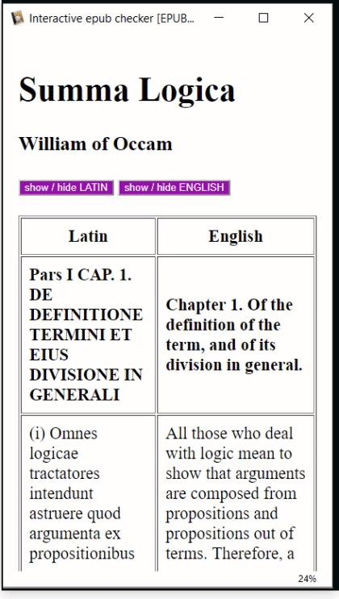

# interactive epub checker
Epub are great educative tools. With this ebook you can test what your reading software accepts.

This ebook (epub) contains a lot of different interactive features. 

* **footnotes**
  * simple footnotes
  * footnotes with images
* **quiz**: 
  * hiding or displaying answer
  * checking if the answer is correct
  * click specific image areas
  * random question (todo)
* **learning languages**: 
  * hiding or displaying translation
* **Styles changes**
  * text in lines
  * text in columns
  * vertical japanese
* **formats**
  * svg images
  * mathml
  * ruby pronunciation above characters
 

[Download the epub](https://github.com/fxpar/interactive-epub-checker/blob/master/Test%20interactive%20Epub%20checker%20(epub3).epub?raw=true) to check some interactive contents on your reader.

# Compatible readers (or partially compatible)
 * Calibre viewer (windows) https://manual.calibre-ebook.com/viewer.html Free, included in calibre, available as portable
 * Lithium (android) https://play.google.com/store/apps/details?id=com.faultexception.reader Free (pay ugrade available, for more themes), No ads.
 * Study Comfort (android) https://play.google.com/store/apps/details?id=com.studycomfort.app Free, No Ads
 * (would be happy to have feedback from Apple users)
 * Gitden (seems free and no ads) https://play.google.com/store/apps/details?id=com.gitden.epub.reader.app&hl=en works as tested by [pleabargain](https://github.com/pleabargain) and demonstrated in this video https://www.youtube.com/watch?v=9Qxd5m8HmgY&feature=youtu.be 
 
# Interactive Features
 

## footnotes
 * simple footnote
 * with styling (bold, italic, underline)
 * with image
 

### footnote with quiz
* displays question
* indicates the correct answer

## Quiz
Quizzes can be achieved through various coding design:
 * inline script
 * in Head script
 * in Head link to Misc script.js
### Forms: Button and Style

### Forms: Fill the gap

## Hide / Display
Mainly used here to hide translations in multilingual ebooks, of for learning languages purposes.

Various coding strategies can be used and are tested in this epub
 * Jquery
 * querySelectorAll
 * InsertRule
 
### Using javascript and css Styles
Click the button with language to see the text in this language appear / disappear.

#### Lines

### Column

### Using title attribute
 * on desktop: mouseover the lines to see translation
 * on mobile / tablet: longpress on lines to see translation

## Click Image Zone
## image map area
 

# Layout, Font and characters Features
No fonts are included in this epub. This will allow to check which characters are correctly displayed.

## svg
No library is included in the epub.

## mathml
No library is included in this epub.
### Compatible tools
 * Calibre viewer (windows)
 * [Lea Reader](https://play.google.com/store/apps/details?id=com.adilibre.leareader) (android)
 * [Gitden] (https://play.google.com/store/apps/details?id=com.gitden.epub.reader.app) (android)

## vertical japanese
Including Furigana (small pronunciation hints aside Chinese characters)

## Ruby 

(for zhuyin Fuhao / bopomofo)

# Compatibility Matrix
 * kobo: aura HD (software version not updated)
 * Kindle: PaperWhite (not updated for a long time)
 * Sigil / PageEdit (very recent)
 
 
| Feature | Calibre Viewer | Lithium | Sigil | kobo | Kindle | Gitden |
| ------------- | ------------- | ------ | ----- | ---- | --- |-----|
| Footnotes | yes | yes | no | yes | yes | yes |
| Alerts  | no  | yes | no | no | no | yes |
| Hide text | yes | yes | no | no | no | yes |
| SVG | yes | yes | no | ? | ? | yes |
| mathml | yes | no | no | ? | ? | yes |
| jquery | yes | ? | ? | ? | ? | no | yes |

# ROADMAP

- [x] Hide with getElementsByClassName
- [x] Hide with querySelectorAll
- [x] Hide with cssRules
- [x] Alerts
- [ ] Random quiz questions
- [x] Vertical (table) hide translation
- [ ] Russian characters
