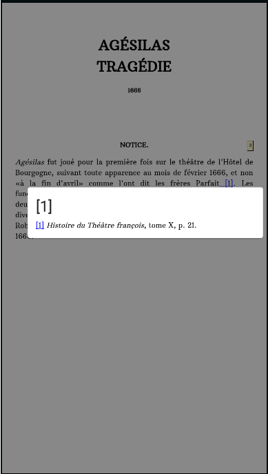
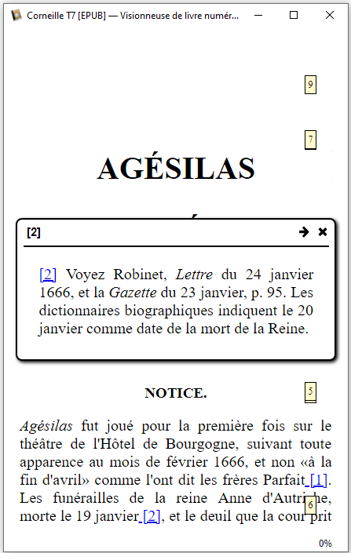

[Download the epub](https://github.com/fxpar/interactive-epub-checker/raw/master/Test%20interactive%20Epub%20checker.epub) to check some interactive contents on your reader.

# interactive epub checker
Epub are great educative tools. Here is a [file](https://github.com/fxpar/interactive-epub-checker/raw/master/Test%20interactive%20Epub%20checker.epub) to test a good deal of interactions with user:
* **creating quiz**: 
  * hiding or displaying answer
  * random question
  * checking if the answer is correct
* **learning languages**: 
  * hiding or displaying translation
  * notes, examples

# Compatible readers (or partially compatible)
 * Calibre viewer (windows) https://manual.calibre-ebook.com/viewer.html Free, included in calibre, available as portable
 * Lithium (android) https://play.google.com/store/apps/details?id=com.faultexception.reader Free (pay ugrade available, for more themes), No ads.
 * Study Comfort (android) https://play.google.com/store/apps/details?id=com.studycomfort.app Free, No Ads
 
# Interactive Features
 
## Inline script

## footnotes

## In Head script
## External script
## Forms
## Jquery
## enrichis
## querySelectorAll
## InsertRule
## character check

## svg

## mathml

## image map area

# Layout, Font and characters Features
## vertical japanese

## Ruby 

(for zhuyin Fuhao / bopomofo)

