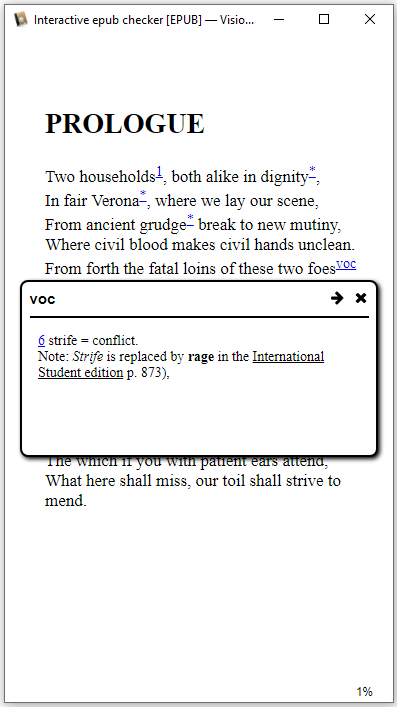
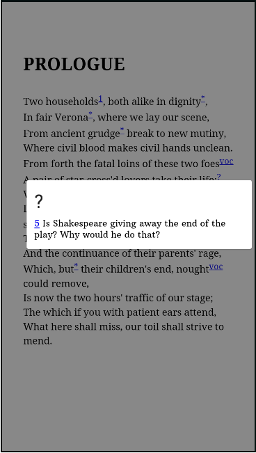

 On this page you will simply find an epub book to let you easily test if your viewer accepts interactions. (epub is a format of electronic book, which includes fonts, images, videos... You must have a specific software to open it.)
 

[Download the epub](https://github.com/fxpar/interactive-epub-checker/blob/master/Test%20interactive%20Epub%20checker%20(epub3).epub?raw=true) to check some interactive contents on your reader.

# interactive epub checker
Epub are great educative tools. 
Here are the interactions I have included in the book, mainly for teaching purposes:

* **quiz**: 
  * hiding or displaying answer
  * checking if the answer is correct
  * random question (todo)
* **learning languages**: 
  * hiding or displaying translation
  * notes, examples

# Compatible readers (or partially compatible)
 * Calibre viewer (windows) https://manual.calibre-ebook.com/viewer.html Free, included in calibre, available as portable
 * Lithium (android) https://play.google.com/store/apps/details?id=com.faultexception.reader Free (pay ugrade available, for more themes), No ads.
 * Study Comfort (android) https://play.google.com/store/apps/details?id=com.studycomfort.app Free, No Ads
 * (would be happy to have feedback from Apple users)
 
# Interactive Features
 

## footnotes
 

### french play

## Quiz
Quizzes can be achieved through various coding design:
 * inline script
 * in Head script
 * in Head link to Misc script.js
### Forms: Button and Style

### Forms: Fill the gap

## Hide / Display
Mainly used here to hide translations in multilingual ebooks, of for learning languages purposes.

Various coding strategies can be used and are tested in this epub
 * Jquery
 * querySelectorAll
 * InsertRule
 
### Using javascript and css Styles
Click the button with language to see the text in this language appear / disappear.
 

### Using title attribute
 * on desktop: mouseover the lines to see translation
 * on mobile / tablet: longpress on lines to see translation

## Click Image Zone
## image map area
 

# Layout, Font and characters Features
No fonts are included in this epub. This will allow to check which characters are correctly displayed.

## svg
No library is included in the epub.

## mathml
No library is included in this epub.
### Compatible tools
 * Calibre viewer (windows)
 * [Lea Reader](https://play.google.com/store/apps/details?id=com.adilibre.leareader) (android)

## vertical japanese

## Ruby 

(for zhuyin Fuhao / bopomofo)

# Compatibility Matrix
 * kobo: aura HD (software version not updated)
 * Kindle: PaperWhite (not updated for a long time)
 * Sigil / PageEdit (very recent)
 
 
| Feature | Calibre Viewer | Lithium | Sigil | kobo | Kindle |
| ------------- | ------------- | ------ | ----- | ---- | --- |
| Footnotes | yes | yes | no | yes | yes |
| Alerts  | no  | yes | no | no | no |
| Hide text | yes | yes | no | no | no |
| SVG | yes | yes | no | ? | ? |
| mathml | yes | no | no | ? | ? |

# ROADMAP

- [x] Hide with getElementsByClassName
- [x] Hide with querySelectorAll
- [x] Hide with cssRules
- [x] Alerts
- [ ] Random quiz questions
- [ ] Vertical (table) hide translation
- [ ] Russian characters
